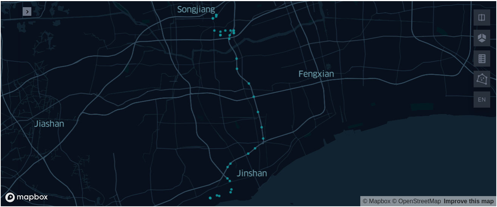
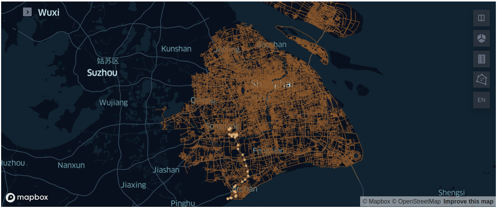
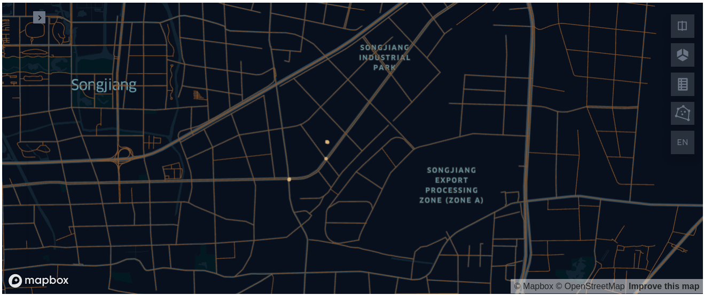
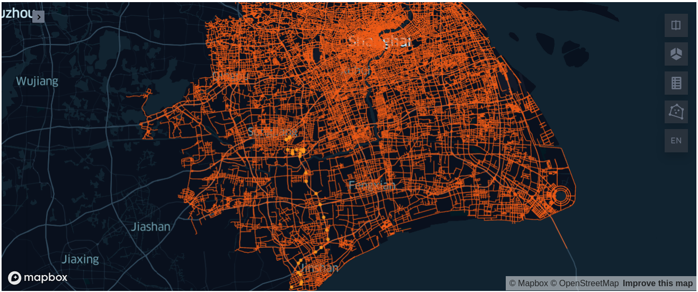
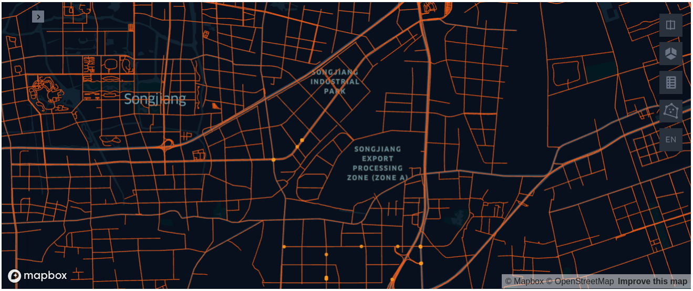
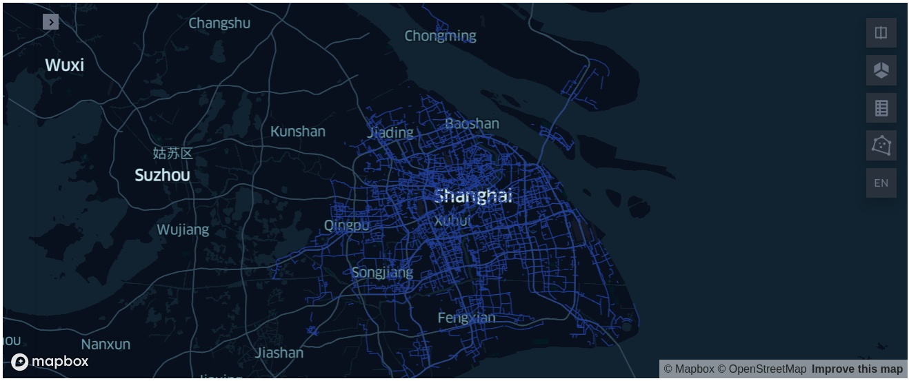
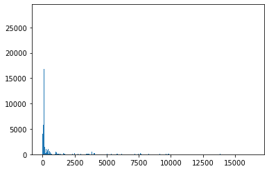
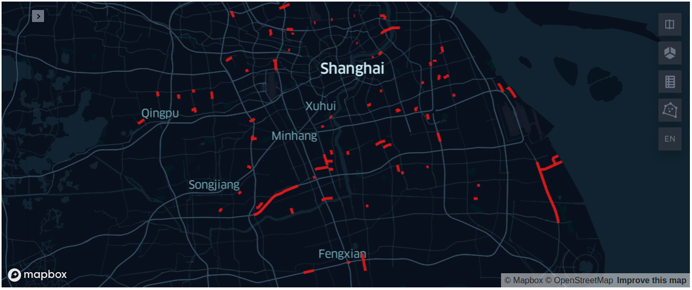

# Arctern 助力分析上海渣土车数据

本文将介绍如何利用 Arctern 处理大型地理空间数据，并使用 kepler.gl 进行数据可视化分析上海渣土车数据集。

## 环境准备

- #### [安装 Arctern](https://arctern.io/docs/versions/v0.2.x/development-doc-cn/html/quick_start/standalone_installation.html)

- #### 安装 Jupyter Notebook

  在上一步中的 `arctern_env` 环境中执行以下命令安装 Jupyter Notebook：

  ```bash
  $ conda install -c conda-forge notebook
  ```

- #### 安装依赖库

  在 `arctern_env` 环境中执行以下命令安装相关依赖库：

  ```bash
  $ pip install keplergl matplotlib
  ```


## 下载数据

我们需要下载 200 多万条上海渣土车数据和上海市的地形数据图数据，默认将其下载至 `/tmp` 下：

```bash
$ cd /tmp
# 下载并解压上海渣土车数据
$ wget https://github.com/arctern-io/arctern-bootcamp/raw/master/shtruck/file/20181016.zip
$ unzip 20181016.zip
# 下载上海市的地形数据图
$ wget https://github.com/arctern-io/arctern-bootcamp/raw/master/shtruck/file/sh_roads.csv
```


## 运行 Jupyter Notebook

下载 [arctern_shtruck_bootcamp.ipynb](https://raw.githubusercontent.com/arctern-io/arctern-bootcamp/master/shtruck/arctern_shtruck_bootcamp.ipynb) 文件，在 `arctern_env` 环境中运行 Jupyter Notebook：

```bash
$ wget https://raw.githubusercontent.com/arctern-io/arctern-bootcamp/master/shtruck/arctern_shtruck_bootcamp.ipynb
# 运行 jupyter notebook
$ jupyter notebook
```

在 Jupyter Notebook 网页中打开 **arctern_shtruck_bootcamp.ipynb** 文件，就可以开始运行代码了。


## 上海渣土车数据分析示例

### 1. 数据加载

加载上海市渣土车运行轨迹数据，原数据共 8 列，此处只读取本文分析所需要的 4 列：车牌号、时间、经度、维度。


```python
import pandas as pd
import arctern
from arctern import GeoSeries

sh_columns=[
    ("plate_number","string"),
    ("pos_time","string"),
    ("pos_longitude","double"),
    ("pos_latitude","double"),
    ("pos_direction0","double"),
    ("pos_direction1","double"),
    ("pos_direction2","double"),
    ("pos_direction3","double")
]

sh_select_columns={
                   "plate_number",
                   "pos_time",
                   "pos_longitude",
                   "pos_latitude"
                  }

sh_schema={}
sh_use_cols=[]
sh_names=[]
for idx in range(len(sh_columns)):
    if sh_columns[idx][0] in sh_select_columns:
        sh_schema[sh_columns[idx][0]] = sh_columns[idx][1]
        sh_use_cols.append(idx)
        sh_names.append(sh_columns[idx][0])
            
sh_df = pd.read_csv("/tmp/20181016.txt",
                    usecols=sh_use_cols,
                    names=sh_names,
                    dtype=sh_schema,
                    header=None,
                    delimiter="\t",
                    date_parser=pd.to_datetime,
                    parse_dates=["pos_time"])
```

根据经纬度信息，构造位置点信息：


```python
sh_df["pos_point"]=GeoSeries.point(sh_df.pos_longitude,sh_df.pos_latitude)
sh_df
```


<div>
<table border="1" class="dataframe">
  <thead>
    <tr style="text-align: right;">
      <th></th>
      <th>plate_number</th>
      <th>pos_time</th>
      <th>pos_longitude</th>
      <th>pos_latitude</th>
      <th>pos_point</th>
    </tr>
  </thead>
  <tbody>
    <tr>
      <th>0</th>
      <td>沪DK7362</td>
      <td>2018-10-16 00:00:00</td>
      <td>121.273108</td>
      <td>30.989863</td>
      <td>POINT (121.273108 30.989863)</td>
    </tr>
    <tr>
      <th>1</th>
      <td>沪DT0830</td>
      <td>2018-10-16 00:00:00</td>
      <td>121.471555</td>
      <td>31.121763</td>
      <td>POINT (121.471555 31.121763)</td>
    </tr>
    <tr>
      <th>2</th>
      <td>沪EP2723</td>
      <td>2018-10-16 00:00:00</td>
      <td>121.717205</td>
      <td>31.380190</td>
      <td>POINT (121.717205 31.38019)</td>
    </tr>
    <tr>
      <th>3</th>
      <td>沪DH9100</td>
      <td>2018-10-16 00:00:00</td>
      <td>121.476368</td>
      <td>31.197768</td>
      <td>POINT (121.476368 31.197768)</td>
    </tr>
    <tr>
      <th>4</th>
      <td>沪DP8608</td>
      <td>2018-10-16 00:00:00</td>
      <td>121.826568</td>
      <td>31.096545</td>
      <td>POINT (121.826568 31.096545)</td>
    </tr>
    <tr>
      <th>...</th>
      <td>...</td>
      <td>...</td>
      <td>...</td>
      <td>...</td>
      <td>...</td>
    </tr>
    <tr>
      <th>2076589</th>
      <td>沪EG9666</td>
      <td>2018-10-16 23:59:31</td>
      <td>121.753138</td>
      <td>31.356040</td>
      <td>POINT (121.753138 31.35604)</td>
    </tr>
    <tr>
      <th>2076590</th>
      <td>沪DP8746</td>
      <td>2018-10-16 23:59:35</td>
      <td>121.447145</td>
      <td>31.125255</td>
      <td>POINT (121.447145 31.125255)</td>
    </tr>
    <tr>
      <th>2076591</th>
      <td>沪DP8746</td>
      <td>2018-10-16 23:59:41</td>
      <td>121.448203</td>
      <td>31.125408</td>
      <td>POINT (121.448203 31.125408)</td>
    </tr>
    <tr>
      <th>2076592</th>
      <td>沪DP8746</td>
      <td>2018-10-16 23:59:48</td>
      <td>121.449426</td>
      <td>31.125510</td>
      <td>POINT (121.449426 31.12551)</td>
    </tr>
    <tr>
      <th>2076593</th>
      <td>沪DE6779</td>
      <td>2018-10-16 23:59:54</td>
      <td>121.880973</td>
      <td>31.082136</td>
      <td>POINT (121.880973 31.082136)</td>
    </tr>
  </tbody>
</table>
<p>2076594 rows × 5 columns</p>
</div>
### 2. 车辆轨迹分析

我们可以根据某一辆车的车牌号，来还原出该车辆的运行轨迹，首先我们选择其中一个车牌号，并筛选该车牌号的所有数据：


```python
one_trunck_plate_number=sh_df.plate_number[0]
print(one_trunck_plate_number)
one_truck_df = sh_df[sh_df.plate_number==one_trunck_plate_number]
```

    沪DK7362


在地图上绘制这辆车的所有轨迹点：


```python
from keplergl import KeplerGl
KeplerGl(data={"car_pos": pd.DataFrame(data={'car_pos':one_truck_df.pos_point.to_wkt()})})
```


### 3. 路网与轨迹信息展示

接下来，我们将根据上海市的路网信息看上述车辆的运行轨迹，首先加载路网信息：


```python
sh_roads=pd.read_csv("/tmp/sh_roads.csv", 
                     dtype={"roads":"string"},
                     usecols=[0],
                     names=["roads"],
                     header=None,
                     delimiter='|')
sh_roads=GeoSeries(sh_roads.roads)
sh_roads
```


    0        LINESTRING (121.6358731 31.221484,121.6359771 ...
    1        LINESTRING (121.6362516 31.2205594,121.6360422...
    2        LINESTRING (121.6372043 31.220911,121.6369344 ...
    3        LINESTRING (121.4637777 31.2314411,121.4637564...
    4        LINESTRING (121.4628334 31.2311683,121.4627892...
                                   ...                        
    74688    LINESTRING (121.2544395 31.0235354,121.2550238...
    74689    LINESTRING (121.6372338 31.2208457,121.6362516...
    74690    LINESTRING (121.6372338 31.2208457,121.6373315...
    74691    LINESTRING (121.3657763 31.085248,121.3656812 ...
    74692    LINESTRING (121.6372043 31.220911,121.6372338 ...
    Name: roads, Length: 74693, dtype: GeoDtype

同时在地图上绘制上述轨迹点信息和路网信息：


```python
one_truck_roads=KeplerGl(data={"car_pos": pd.DataFrame(data={'car_pos':one_truck_df.pos_point.to_wkt()})})
one_truck_roads.add_data(data=pd.DataFrame(data={'sh_roads':sh_roads.to_wkt()}),name="sh_roads")
one_truck_roads
```



返回的地图结果支持交互，通过局部放大，在下图中可以发现该车辆的某些轨迹点并不在道路上，这些噪点数据就需要清洗。




- #### 数据清洗

我们认为不在路上的轨迹点为噪点信息，需要将轨迹点绑定到离它最近的一条道路上：


```python
is_near_road=arctern.near_road(sh_roads,sh_df.pos_point)
sh_near_road_df=sh_df[is_near_road]
on_road=arctern.nearest_location_on_road(sh_roads, sh_near_road_df.pos_point)
on_road=GeoSeries(on_road)
on_road
```


    0          POINT (121.273065837839 30.9898629672054)
    1          POINT (121.471521117758 31.1218966267949)
    2          POINT (121.717183265368 31.3801593122801)
    3           POINT (121.47636780833 31.1977688430427)
    4          POINT (121.826533061028 31.0965194009541)
                                 ...                    
    2076589    POINT (121.753124012736 31.3560208068604)
    2076590     POINT (121.44712530551 31.1255173541719)
    2076591    POINT (121.448188797914 31.1255971887735)
    2076592    POINT (121.449412558681 31.1256890544539)
    2076593    POINT (121.880966206794 31.0821528456654)
    Length: 1807018, dtype: GeoDtype

- #### 绑路算法

将车辆轨迹点绑定到道路，重新构造 `DataFrame`：


```python
sh_on_road_df=pd.DataFrame(data={"plate_number":sh_near_road_df.plate_number,
                                 "pos_time":sh_near_road_df.pos_time,
                                 "on_road":on_road
                                })
sh_on_road_df
```


<div>
<table border="1" class="dataframe">
  <thead>
    <tr style="text-align: right;">
      <th></th>
      <th>plate_number</th>
      <th>pos_time</th>
      <th>on_road</th>
    </tr>
  </thead>
  <tbody>
    <tr>
      <th>0</th>
      <td>沪DK7362</td>
      <td>2018-10-16 00:00:00</td>
      <td>POINT (121.273065837839 30.9898629672054)</td>
    </tr>
    <tr>
      <th>1</th>
      <td>沪DT0830</td>
      <td>2018-10-16 00:00:00</td>
      <td>POINT (121.471521117758 31.1218966267949)</td>
    </tr>
    <tr>
      <th>2</th>
      <td>沪EP2723</td>
      <td>2018-10-16 00:00:00</td>
      <td>POINT (121.717183265368 31.3801593122801)</td>
    </tr>
    <tr>
      <th>3</th>
      <td>沪DH9100</td>
      <td>2018-10-16 00:00:00</td>
      <td>POINT (121.47636780833 31.1977688430427)</td>
    </tr>
    <tr>
      <th>4</th>
      <td>沪DP8608</td>
      <td>2018-10-16 00:00:00</td>
      <td>POINT (121.826533061028 31.0965194009541)</td>
    </tr>
    <tr>
      <th>...</th>
      <td>...</td>
      <td>...</td>
      <td>...</td>
    </tr>
    <tr>
      <th>2076589</th>
      <td>沪EG9666</td>
      <td>2018-10-16 23:59:31</td>
      <td>POINT (121.753124012736 31.3560208068604)</td>
    </tr>
    <tr>
      <th>2076590</th>
      <td>沪DP8746</td>
      <td>2018-10-16 23:59:35</td>
      <td>POINT (121.44712530551 31.1255173541719)</td>
    </tr>
    <tr>
      <th>2076591</th>
      <td>沪DP8746</td>
      <td>2018-10-16 23:59:41</td>
      <td>POINT (121.448188797914 31.1255971887735)</td>
    </tr>
    <tr>
      <th>2076592</th>
      <td>沪DP8746</td>
      <td>2018-10-16 23:59:48</td>
      <td>POINT (121.449412558681 31.1256890544539)</td>
    </tr>
    <tr>
      <th>2076593</th>
      <td>沪DE6779</td>
      <td>2018-10-16 23:59:54</td>
      <td>POINT (121.880966206794 31.0821528456654)</td>
    </tr>
  </tbody>
</table>
<p>1807018 rows × 3 columns</p>
</div>

再次绘制前述车辆的轨迹点及上海市的路网信息：


```python
one_on_road_df=sh_on_road_df[sh_on_road_df.plate_number==one_trunck_plate_number]
one_on_roads=KeplerGl(data={"car_pos": pd.DataFrame(data={'car_pos':one_on_road_df.on_road.to_wkt()})})
one_on_roads.add_data(data=pd.DataFrame(data={'sh_roads':sh_roads.to_wkt()}),name="sh_roads")
one_on_roads
```



局部放大后，可以看出所有点均在道路上：




### 4. 道路分析

我们了解到，上海市的道路网信息共 74693 条记录，但并不是所有道路都会被渣土车经过，我们将对渣土车经过的道路进行分析，查看哪些道路是渣土车经过频率最高的。

- #### 渣土车道路绘制

首先筛选出渣土车经过的所有道路：


```python
all_roads=arctern.nearest_road(sh_roads,sh_on_road_df.on_road)
all_roads=GeoSeries(all_roads)
road_codes, road_uniques = pd.factorize(all_roads)
```

打印所有渣土车经过的道路数据，及所占整体道路的百分比：


```python
print(len(road_uniques))
print(len(road_uniques)*100.0/len(sh_roads))
```

    16450
    22.0234827895519


绘制渣土车经过的所有道路：


```python
KeplerGl(data={"all_roads": pd.DataFrame(data={'all_roads':GeoSeries(road_uniques).to_wkt()})})
```



可以看出，对于一些主干道路，每辆渣土车都可能会经过，导致这条道路上的 GPS 信号采样点比较多，同时因为是主干道路，经过车辆比较多，导致渣土车速度缓慢，进一步加强该道路上的 GPS 采样点数据。

接下来我们将根据道路上渣土车的采样点数目，来寻找较繁忙的道路。

- #### 渣土车道路权重分析

统计每条道路上的 GPS 采样点数目，并重新构建 `DataFrame` ，我们把道路上 GPS 采样点的数据记为道路权重：


```python
roads_codes_series = pd.Series(road_codes)
roads_codes_series = roads_codes_series.value_counts()
roads_codes_series = roads_codes_series.sort_index()

sh_road_weight = pd.DataFrame(data={"on_road":GeoSeries(road_uniques),
                                    "weight_value":roads_codes_series
                                   })

sh_road_weight
```


<div>
<table border="1" class="dataframe">
  <thead>
    <tr style="text-align: right;">
      <th></th>
      <th>on_road</th>
      <th>weight_value</th>
    </tr>
  </thead>
  <tbody>
    <tr>
      <th>0</th>
      <td>LINESTRING (121.2730666 30.9888831,121.2730596...</td>
      <td>1646</td>
    </tr>
    <tr>
      <th>1</th>
      <td>LINESTRING (121.4677565 31.1198416,121.4678423...</td>
      <td>1579</td>
    </tr>
    <tr>
      <th>2</th>
      <td>LINESTRING (121.7202751 31.3780202,121.7197339...</td>
      <td>141</td>
    </tr>
    <tr>
      <th>3</th>
      <td>LINESTRING (121.477849 31.1981056,121.4742212 ...</td>
      <td>83</td>
    </tr>
    <tr>
      <th>4</th>
      <td>LINESTRING (121.8374393 31.0816313,121.8345587...</td>
      <td>1268</td>
    </tr>
    <tr>
      <th>...</th>
      <td>...</td>
      <td>...</td>
    </tr>
    <tr>
      <th>16445</th>
      <td>LINESTRING (121.4278848 31.2389835,121.4280869...</td>
      <td>3</td>
    </tr>
    <tr>
      <th>16446</th>
      <td>LINESTRING (121.431042 31.2403309,121.4307167 ...</td>
      <td>1</td>
    </tr>
    <tr>
      <th>16447</th>
      <td>LINESTRING (121.6378175 31.2374256,121.6373658...</td>
      <td>1</td>
    </tr>
    <tr>
      <th>16448</th>
      <td>LINESTRING (121.432118 31.2416392,121.4314564 ...</td>
      <td>1</td>
    </tr>
    <tr>
      <th>16449</th>
      <td>LINESTRING (121.4444113 30.9236353,121.443815 ...</td>
      <td>2</td>
    </tr>
  </tbody>
</table>
<p>16450 rows × 2 columns</p>
</div>

输出道道路权重的基本概况：


```python
sh_road_weight.weight_value.describe()
```


    count    16450.000000
    mean       109.849119
    std        802.067993
    min          1.000000
    25%          2.000000
    50%          5.000000
    75%         22.000000
    max      28144.000000
    Name: weight_value, dtype: float64

可以发现大部分道路是不繁忙的，但是也存在特别繁忙的道路。

将`weight_value`绘制成柱状图：


```python
import matplotlib.pyplot as plt
plt.bar(sh_road_weight.index,sh_road_weight.weight_value)
plt.show()
```




从柱状图可对上一结论进一步佐证。

按照道路权重，对所有道路做排序：


```python
sh_sorted_road=sh_road_weight.sort_values(by=['weight_value'],ascending=False)
sh_sorted_road
```


<div>
<table border="1" class="dataframe">
  <thead>
    <tr style="text-align: right;">
      <th></th>
      <th>on_road</th>
      <th>weight_value</th>
    </tr>
  </thead>
  <tbody>
    <tr>
      <th>102</th>
      <td>LINESTRING (121.4248121 31.4032657,121.4265065...</td>
      <td>28144</td>
    </tr>
    <tr>
      <th>23</th>
      <td>LINESTRING (121.473513 31.3702961,121.4736103 ...</td>
      <td>24364</td>
    </tr>
    <tr>
      <th>9</th>
      <td>LINESTRING (121.6349225 31.14309,121.6348039 3...</td>
      <td>21448</td>
    </tr>
    <tr>
      <th>43</th>
      <td>LINESTRING (121.2749664 31.0244814,121.2722674...</td>
      <td>20599</td>
    </tr>
    <tr>
      <th>89</th>
      <td>LINESTRING (121.3814009 31.391344,121.3820681 ...</td>
      <td>20463</td>
    </tr>
    <tr>
      <th>...</th>
      <td>...</td>
      <td>...</td>
    </tr>
    <tr>
      <th>13661</th>
      <td>LINESTRING (121.3757469 31.0789625,121.3756868...</td>
      <td>1</td>
    </tr>
    <tr>
      <th>7980</th>
      <td>LINESTRING (121.3675949 31.2531523,121.3677313...</td>
      <td>1</td>
    </tr>
    <tr>
      <th>11360</th>
      <td>LINESTRING (121.6867871 31.104265,121.6815152 ...</td>
      <td>1</td>
    </tr>
    <tr>
      <th>13664</th>
      <td>LINESTRING (121.5174295 31.2760579,121.5171332...</td>
      <td>1</td>
    </tr>
    <tr>
      <th>14269</th>
      <td>LINESTRING (121.3291131 31.7212865,121.3269348...</td>
      <td>1</td>
    </tr>
  </tbody>
</table>
<p>16450 rows × 2 columns</p>
</div>

选取最繁忙的前 100 个路段：


```python
sh_sorted_road.iloc[0:100]
```


<div>
<table border="1" class="dataframe">
  <thead>
    <tr style="text-align: right;">
      <th></th>
      <th>on_road</th>
      <th>weight_value</th>
    </tr>
  </thead>
  <tbody>
    <tr>
      <th>102</th>
      <td>LINESTRING (121.4248121 31.4032657,121.4265065...</td>
      <td>28144</td>
    </tr>
    <tr>
      <th>23</th>
      <td>LINESTRING (121.473513 31.3702961,121.4736103 ...</td>
      <td>24364</td>
    </tr>
    <tr>
      <th>9</th>
      <td>LINESTRING (121.6349225 31.14309,121.6348039 3...</td>
      <td>21448</td>
    </tr>
    <tr>
      <th>43</th>
      <td>LINESTRING (121.2749664 31.0244814,121.2722674...</td>
      <td>20599</td>
    </tr>
    <tr>
      <th>89</th>
      <td>LINESTRING (121.3814009 31.391344,121.3820681 ...</td>
      <td>20463</td>
    </tr>
    <tr>
      <th>...</th>
      <td>...</td>
      <td>...</td>
    </tr>
    <tr>
      <th>13</th>
      <td>LINESTRING (121.4986731 31.2685444,121.4963124...</td>
      <td>3668</td>
    </tr>
    <tr>
      <th>566</th>
      <td>LINESTRING (121.3656233 31.257495,121.3689789 ...</td>
      <td>3655</td>
    </tr>
    <tr>
      <th>291</th>
      <td>LINESTRING (121.5675539 31.3573854,121.5650207...</td>
      <td>3625</td>
    </tr>
    <tr>
      <th>759</th>
      <td>LINESTRING (121.4644001 31.3612873,121.463751 ...</td>
      <td>3622</td>
    </tr>
    <tr>
      <th>345</th>
      <td>LINESTRING (121.297295 31.1168969,121.2973077 ...</td>
      <td>3616</td>
    </tr>
  </tbody>
</table>
<p>100 rows × 2 columns</p>
</div>

在地图上绘制最繁忙的前 100 个路段：


```python
KeplerGl(data={"on_roads": pd.DataFrame(data={'on_roads':sh_sorted_road.on_road.iloc[0:100].to_wkt()})})
```

